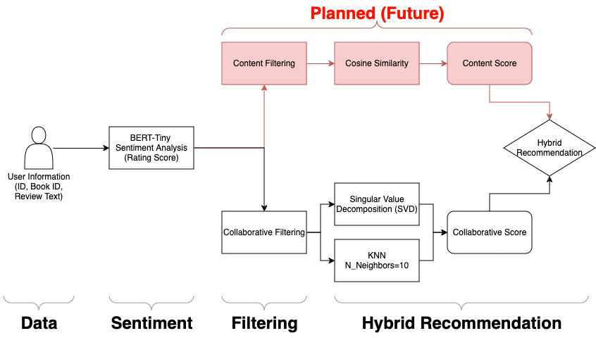

# Goodreads Book Recommendation AI

A goodreads book recommendation system, using BERT-Tiny sentiment analysis and KNN/SVD collaborative filtering methods. 

___

### Brief Information

This AI was a part of a Physics 5680 big data analytics in physics course. The `Project.ipynb` file should be the main one to visit to see the code. For a more general overview of the details of the project, see the `poster.pdf` project poster file, or for more detailed analysis, see the `report.pdf` project report file. 

___

### Project Pipeline

___

[Back to Top](#goodreads-book-recommendation-ai)

This page was last edited on 12.11.2024